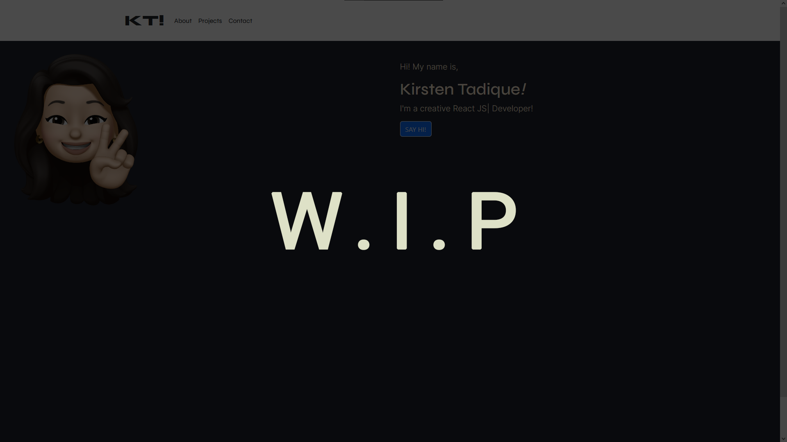

# KT Portfolio (WIP)

## Description

This repository contains the code for my updated, work-in-progress portfolio created with React JS.

## Table of Contents

- [Description](#description)
- [KT Portfolio Preview](#kt-portfolio-preview)
- [License](#license)
- [Contributing](#contributing)
- [Tests](#tests)
- [Questions](#questions)

## KT Portfolio Preview

## License

This project is licensed under the MIT license.

## Contributing

To contribute to this project, fork and clone this repository locally, then submit a pull request.

## Questions

This README was generated using the [README Generator](https://github.com/ktadique/README-Generator)!

If you have any questions regarding this project, please contact me via [email](mailto:kch.tadique@gmail.com) 
Or check out my GitHub **@[ktadique](https://github.com/ktadique)** for my other projects!
